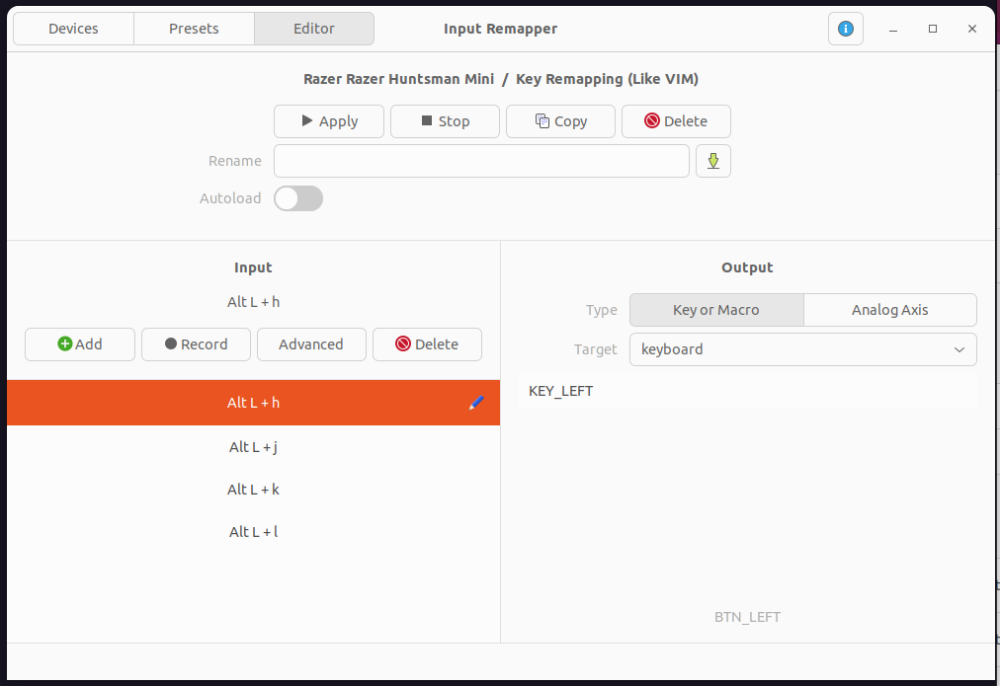

# vim-borra-config

# Install Latest Neovim
Reference: https://github.com/neovim/neovim/releases/tag/nightly
```
wget https://github.com/neovim/neovim/releases/download/nightly/nvim.appimage
chmod u+x nvim.appimage
./nvim.appimage --appimage-extract
sudo ln -s /home/jcarranz/.nvim/squashfs-root/usr/bin/nvim /usr/bin/nvim
```

# Create symlinks
```
ln -s /home/jcarranz/repos/vim-borra-config/.vimrc /home/jcarranz/.vimrc
ln -s /home/jcarranz/repos/vim-borra-config/.jcarranz_rc /home/jcarranz/.jcarranz_rc
ln -s /home/jcarranz/repos/vim-borra-config/.tmux.conf /home/jcarranz/.tmux.conf
```

# Modify VIMINIT
```
export MYVIMRC=/home/jcarranz/.vimrc
export VIMINIT='source $MYVIMRC'
```

# Add below lines in .bashrc file
```
if [ -f ~/.jcarranz_rc ]; then
    . ~/.jcarranz_rc
fi
```

# Download Bundle
```
git clone https://github.com/VundleVim/Vundle.vim.git ~/.vim/bundle/Vundle.vim
```

Open vim and Run PluginInstall

# Create git aliasesvimrc
```
git config --global alias.co checkout
git config --global alias.br branch
git config --global alias.ci commit
git config --global alias.st status
```

# Other helpfull links
https://vi.stackexchange.com/questions/3359/how-do-i-fix-the-status-bar-symbols-in-the-airline-plugin
https://docs.microsoft.com/en-us/windows/terminal/tutorials/custom-prompt-setup#install-a-nerd-font
https://windowsterminalthemes.dev

# Key remmaping (Ubuntu)
Install input remmapper from https://github.com/sezanzeb/input-remapper

Then do custom remapping




# Note taking APP
joplin
https://joplinapp.org/help/#desktop-applications

Installation
```
wget -O - https://raw.githubusercontent.com/laurent22/joplin/dev/Joplin_install_and_update.sh | bash
```
